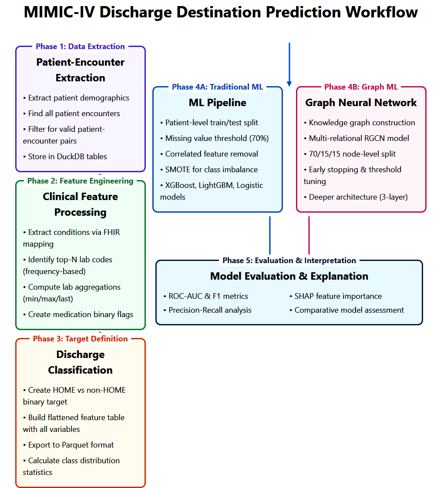

# Discharge Destination Classification Using MIMIC-IV FHIR Data

## Abstract
Effective discharge planning significantly influences patient outcomes, yet clinical decisions often rely on incomplete data or subjective judgment. This research introduces an innovative hybrid predictive modeling framework combining classical tabular machine learning methods (Logistic Regression, XGBoost, LightGBM) and an advanced Relational Graph Convolutional Network (R-GCN) leveraging structured healthcare data from the MIMIC-IV FHIR dataset. Utilizing demographics, vital signs, medications, diagnoses, and laboratory tests, this study forecasts whether patients will be discharged home or require additional care in skilled nursing or rehabilitation facilities.

Contrary to conventional models focusing solely on readmission risk, this research addresses the critical clinical decision point of discharge disposition, which impacts resource allocation and patient management. Classical ML models demonstrated strong predictive performance (AUC ~0.90), with SHAP interpretability validating clinical relevance. The R-GCN model provided moderate predictive power (AUC ~0.78), offering valuable insights into relational structures inherent in patient care trajectories. Together, these approaches underscore the utility of hybrid modeling to enhance clinical decisions through accurate and interpretable predictions.

---

## Project Objectives
1. **Design a Clinically Relevant Binary Classification Model**  
   Accurately predict patient discharge to home versus non-home settings (rehabilitation, skilled nursing).

2. **Investigate Complementary Strengths of Tabular vs. Graph-Based ML**  
   Evaluate traditional machine learning pipelines against relational graph models to understand their respective capabilities in capturing patient complexity.

3. **Enhance Clinical Interpretability**  
   Employ explainability tools such as SHAP for classical ML and embedding analysis for R-GCN, facilitating clinically meaningful insights.

4. **Demonstrate Advanced Data Engineering and Integration Skills**  
   Utilize robust data integration (DuckDB, SQL, PyTorch Geometric) for scalable and reproducible analysis adaptable to other EHR datasets.

---

## System Requirements & Dataset Considerations

### MIMIC-IV on FHIR
- **Data Source**: PhysioNet’s MIMIC-IV structured in HL7 FHIR format.  
- **Key Profiles**: Encounters, Conditions, Observations (Labs), MedicationAdministration.  
- **Access Requirements**: Independently obtain from PhysioNet due to HIPAA and data use agreements. Raw data distribution prohibited.

### Computational Environment
- **Local GPU** recommended (CUDA support) for efficient R-GCN and complex ensemble training.  
- **CPU Execution**: Supported but significantly slower; requires batch size adjustments.

### Data Volume & Integration
- Original MIMIC-IV FHIR NDJSON: Several GB compressed.  
- DuckDB database (`mimic_data.db`): Approximately 2–3GB post-merging.  
- Data preprocessing includes missing-value imputation, frequency-based feature selection, and numeric standardization.

---

## Project Workflow Overview

The following diagram outlines the complete workflow used in my project, from initial data extraction and preprocessing to modeling, evaluation, and interpretation. It visually summarizes the integration of the machine learning pipelines and the R-GCN.

---

## Methodological Framework
This project demonstrates sophisticated data engineering and novel feature construction methods vital for robust ML/DL modeling in healthcare:

### 1. Multi-phase Data Pipeline
1. **Extraction & Relational Linking**  
   - Integrated encounter, patient, condition, medication data via DuckDB.  
   - Ensured alignment through primary keys (patient ID, encounter ID).

2. **Feature Engineering**  
   - **Lab Events**: Min, max, last measurements across key labs (creatinine, hemoglobin).  
   - **Medication Flags**: Binary indicators for frequently administered drugs.  
   - **Demographics**: Age at admission, race, gender, admission type.  
   - **Encounter Attributes**: Length of stay, comorbidity counts.

3. **Label Definition**  
   - Binary outcome (`disposition_binary`): 1 (non-home), 0 (home discharge).

4. **Partitioning & Cross-Validation**  
   - Patient-level split with GroupKFold to prevent data leakage.

---

## Exploratory Data Analysis & Interpretability

### Patient Journey Example
Illustrates complexity in patient trajectories, highlighting transitions influencing discharge planning:

### EDA Observations
- Older adults frequently transitioned to non-home facilities.  
- High medication counts and abnormal lab values correlated with complex discharges.

### SHAP Analysis (Tabular Models)
SHAP revealed age, comorbidities, medication usage, and lab anomalies as influential in predicting discharge outcomes:

---

## Classical Machine Learning Pipelines
Detailed exploration of Logistic Regression, XGBoost, and LightGBM models:

- **Logistic Regression**: Tuned regularization, balanced class weighting; AUC ~0.85, precision ~0.88, recall ~0.76.
- **XGBoost**: Tree-based, optimized via RandomizedSearchCV; best AUC ~0.90, high recall ~0.96.
- **LightGBM**: Dart boosting, balanced performance with AUC ~0.90, precision ~0.91.

### ROC Comparison
Performance summary:

---

## Relational Graph Convolutional Network (R-GCN)

### Model Architecture
- Nodes: Encounters, Conditions, Medications; Edges represent clinical relationships.
- Deep architecture: 3 RGCNConv layers, hidden_dim=128, dropout=0.4, class imbalance mitigation via weighted loss.

### Performance
- AUC ~0.78, F1 ~0.81 at threshold=0.30. Notably, the graph model captured complex relational contexts despite lower overall AUC compared to classical ML.

---

## Key Domain Insights
- **Age & Comorbidities**: Strong predictors aligning with clinical expectations.
- **Medication Intensities**: Multiple or high-risk medications associated with non-home transitions.
- **Lab Extremes**: Abnormal lab values correlated with increased non-home discharges.

---

## Broader Evaluation & Takeaways
- **Model Comparisons**: XGBoost provided highest predictive performance; Logistic Regression ensured interpretability; LightGBM balanced precision and recall.
- **GNN Feasibility**: Demonstrated value in capturing relational complexities but required additional refinement.
- **Interpretability**: SHAP insights validated clinically relevant predictors, highlighting actionable features for targeted clinical interventions.

---

## Limitations & Future Directions
- **Generalizability**: Multi-site validation needed.
- **Graph Embeddings**: Potential improvement through advanced relational embedding techniques.
- **Time-Series Granularity**: Enhanced temporal resolution could further improve predictions.
- **Data Completeness**: Addressing data gaps through advanced imputation strategies.

---

## Ethical Considerations and Data Usage

This research adheres to MIMIC-IV Data Use Agreements (DUA) to ensure patient privacy and compliance with regulatory guidelines. No patient data is shared in this repository, and all data must be accessed through PhysioNet under controlled conditions.

- **Data cannot be publicly distributed** due to de-identification constraints.
- **Model outputs must be used responsibly** to prevent biased or misleading clinical applications.
- **Researchers must obtain MIMIC-IV access independently** to replicate results.

For dataset access and compliance, refer to the [PhysioNet MIMIC-IV database](https://physionet.org/content/mimiciv/).

---

## License
- **MIT License**: Open-sourced for broad academic and practical applicability.