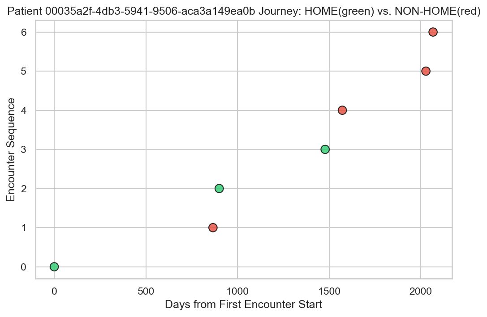
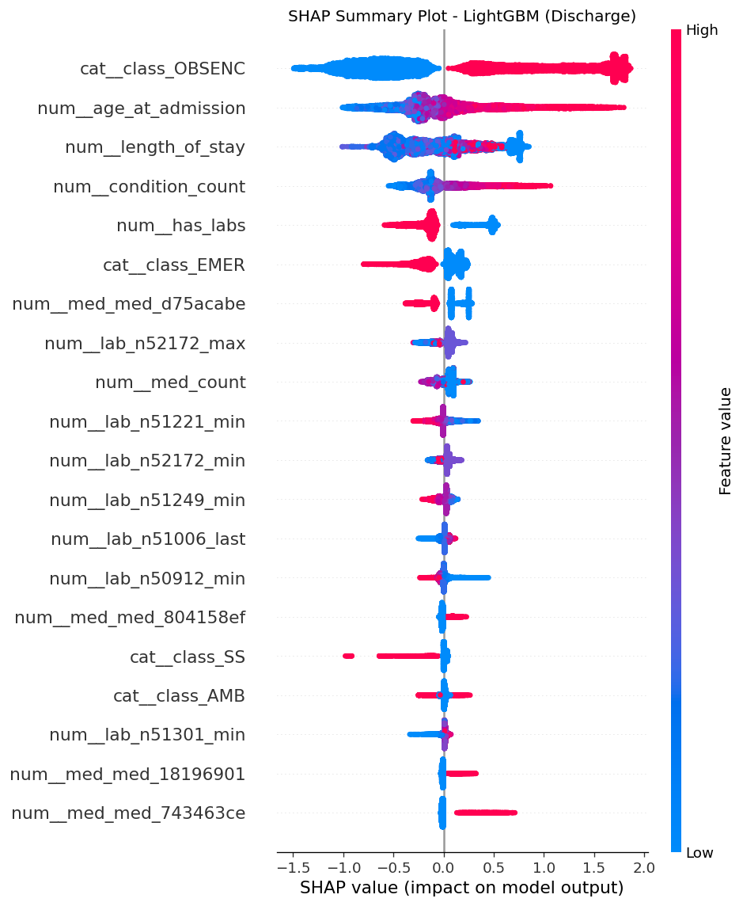
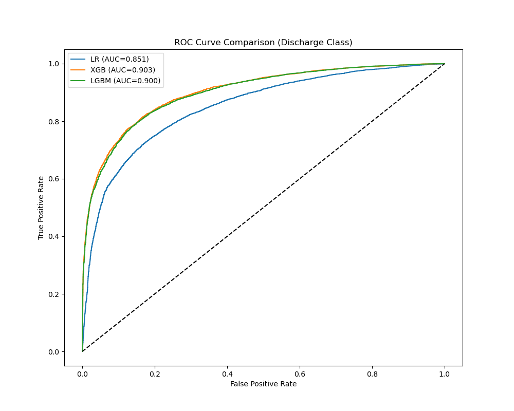
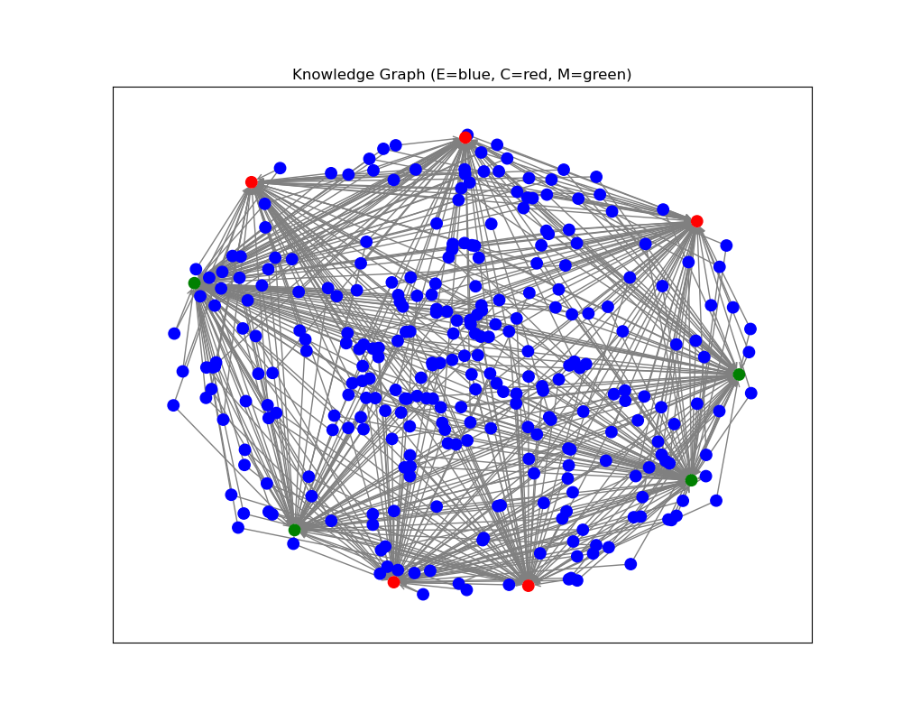

# Discharge Destination Classification Using MIMIC-IV FHIR Data

## Abstract
Discharge planning is an important component of patient care, though clinicians often make decisions about home vs. non-home discharge based on incomplete data or subjective judgment. This repository presents a **hybrid approach** incorporating both **tabular machine learning pipelines** and a **Relational Graph Convolutional Network (R-GCN)** to predict discharge destinations. Using the **MIMIC-IV** database (structured in **FHIR** format), our models draw from vital signs, lab tests, medications, diagnoses, and demographic details to forecast if a patient will return home or transition to a rehab/skilled nursing facility.

Contrary to conventional readmission or length-of-stay predictions, this classification task focuses on **disposition to non-home** settings, addressing a practical need for **efficient resource allocation** and earlier interventions. The project’s **tabular ML** pipelines (Logistic Regression, XGBoost, and LightGBM) outperform the **R-GCN** in raw AUC, though the **knowledge graph approach** shows the potential of **graph-structured data** to reflect multi-relational healthcare insights. By integrating **SHAP interpretability**, class weighting, and patient-level cross-validation, we aim to present a consistent and **clear** discharge outcome modeling pipeline.

---

## Project Objectives
1. **Develop a Binary Classification Model**  
   Determine whether a patient will be discharged **home** vs. a **non-home** facility (skilled nursing, rehab, hospice).

2. **Explore Tabular vs. Graph Approaches**  
   Compare traditional ML pipelines (Logistic Regression, XGBoost, LightGBM) with a **Graph Neural Network** (R-GCN) to determine which paradigm best captures patient complexity.

3. **Enhance Clinical Interpretability**  
   Integrate explainability tools, including **SHAP** for tabular models and **attention/embedding analysis** for the graph model, to empower data-driven, clinically meaningful insights.

4. **Demonstrate Scalable Data Processing**  
   Implement a multi-phase data integration pipeline using **DuckDB** and feature engineering techniques that easily extend to other EHR datasets.

---

## System Requirements & Dataset Considerations

### MIMIC-IV on FHIR
- **Data Source**: MIMIC-IV (PhysioNet) structured in HL7 FHIR format  
- **Key Profiles**: Encounters, Conditions, Observations (Labs), MedicationAdministration  
- **Access Requirements**: Due to **HIPAA** and data use agreements, MIMIC-IV must be requested independently via PhysioNet. This repo does **not** distribute raw data.

### Local Execution & GPU Support
- **Local GPU** (CUDA recommended) for faster training of R-GCN layers and complex ML ensembles.  
- **CPU Execution**: Possible but slower. Batch size and parallelism must be tuned accordingly.

### Data Volume & Integration
- **File Sizes**:  
  - Original MIMIC-IV FHIR NDJSON: Several GB compressed  
  - DuckDB database (`mimic_data.db`): ~2–3GB after merging  
- **Preprocessing**: Missing-value handling, frequency-based feature selection (top lab tests, medications), numeric standardization.

---

## Methodological Framework

### 1. Multi-phase Data Pipeline
1. **Extraction & Relational Linking**  
   - **DuckDB** merges encounter, patient, condition, and medication data.  
   - Primary keys (patient ID, encounter ID) ensure correct alignment of clinical events.

2. **Feature Engineering**  
   - **Lab Tests** (min, max, last) across top 50 codes  
   - **Medication Flags** for high-frequency drugs  
   - **Demographics** (age, gender, ethnicity)  
   - **Encounter Details** (season of admission, length of stay, comorbidity counts)

3. **Label Definition**  
   - `disposition_binary` = **1** for non-home discharge, **0** for home discharge.

4. **Partitioning & Cross-Validation**  
   - **Patient-level** split avoids data leakage across admissions of the same patient.  
   - **GroupKFold** ensures robust sampling for hyperparameter tuning.

---

## Exploratory Data Analysis & Interpretability

### Patient Journey Example
To illustrate how real-world patient trajectories can span multiple admissions and involve complex clinical transitions:

This example highlights how patients initially admitted for one condition may accumulate new diagnoses or medications, ultimately influencing their discharge plan.

### 1. EDA Observations
- **Older Adults** more frequently discharged to non-home facilities.  
- **High Medication Counts** or **unusual lab values** correlated with complex discharges.  
- Some patients show **long stays** and **multiple comorbidities** leading to rehab or skilled nursing.

### 2. SHAP Analysis (Tabular)
For the LightGBM model, **SHAP** helps uncover which features (e.g., age, lab aggregates, medications) push predictions toward non-home vs. home discharges.

Positive SHAP values (pink) indicate a higher probability of non-home discharge, whereas negative values (blue) nudge the prediction toward home.

---

## ML Pipeline (Tabular Models)
We train and evaluate **Logistic Regression**, **XGBoost**, and **LightGBM** to handle diverse patterns in EHR data:

- **Hyperparameter Tuning**: Randomized search with `roc_auc` scoring  
- **Training Strategy**: Balanced weighting for moderate class imbalance; patient-level GroupKFold  
- **Interpretability**: SHAP for feature importances

### Key Tabular Findings
- **XGBoost** typically achieves the highest **AUC** (~0.90+), capturing a high recall for non-home discharges.  
- **Logistic Regression** is notably interpretable with moderate AUC (~0.85).  
- **LightGBM** offers a strong balance of performance and fewer hyperparameters.

#### ROC Comparison
The following plot showcases how each model performs in separating home vs. non-home discharges:

XGBoost exhibits the highest discriminative power, while Logistic Regression and LightGBM closely follow.

---

## Relational Graph Convolutional Network (R-GCN)

### Model Architecture
- **Graph Nodes**: Encounters, Conditions, Medications  
- **Edges**: (Encounter → Condition), (Encounter → Medication), (Encounter → Encounter)  
- **3-layer R-GCN** with dropout and weighted BCE loss for class imbalance

While the R-GCN captures relational context (e.g., frequently co-occurring diagnoses, sequential admissions), its raw AUC (~0.78) is lower than the best tabular models. Future enhancements could improve embedding richness and multi-relational learning.

---

## Limitations & Future Directions
- **Single-Site Data**: MIMIC-IV from one institution may limit broader generalizability.  
- **Graph Model Performance**: R-GCN’s AUC lags behind simpler ML approaches. Integrating multi-task objectives or deeper graph embeddings may help.  
- **Temporal Sequencing**: More refined time-series patterns (sub-encounter granularity) could improve predictive accuracy.  
- **Data Gaps**: Missing or delayed documentation can skew certain features or lab aggregates.

---

## Ethical Considerations and Data Usage

This research adheres to MIMIC-IV Data Use Agreements (DUA) to ensure patient privacy and compliance with regulatory guidelines. No patient data is shared in this repository, and all data must be accessed through PhysioNet under controlled conditions.

- **Data cannot be publicly distributed** due to de-identification constraints.
- **Model outputs must be used responsibly** to prevent biased or misleading clinical applications.
- **Researchers must obtain MIMIC-IV access independently** to replicate results.

For dataset access and compliance, refer to the [PhysioNet MIMIC-IV database](https://physionet.org/content/mimiciv/).

---

## References
1. **MIMIC-IV on FHIR** – PhysioNet.
2. Alsentzer, E. et al. (2019). *ClinicalBERT: Modeling clinical notes and predicting hospital readmission*.  
3. Choi, E. et al. (2016). *Multi-layer representation learning for medical concepts*.  

---

## License
- **MIT License**: This project is open-sourced under the MIT License for broad applicability.  
- **PhysioNet DUA**: Researchers must independently obtain MIMIC-IV data from PhysioNet under the appropriate Data Use Agreement.